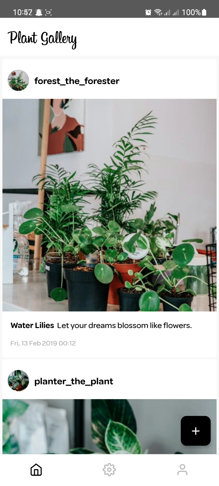

# Plant Gallery


> **Note**: Make sure you have completed the [Set Up Your Environment](https://reactnative.dev/docs/set-up-your-environment) guide before proceeding.

## Step 1: Installing dependencies

First, you will need to run **npm install**. This will refer to the package.json file and download all the necessary dependencies.

To start the Metro dev server, run the following command from the root of your React Native project:

```sh
# Using npm
npm install
```

## Step 2: Build and run the app in android

Open terminal in VS code and run **npx react-native run-android**. This will install the developer version of the app. **Make sure to have Android Emulator or connect an Android device with the PC.**

```sh
# Using npm
npx react-native run-android
```

## Frequent Errors:
- Make sure to have java set in environment variable.


### Images of the App




### There is a video that I have uploaded in YouTube. I have demonstrated the usage and functions of the App.

**Link to youTube Demo =>** https://youtu.be/BYbbRnopRSg?si=aU_LGj6WWbeT3VR6

# Thank You